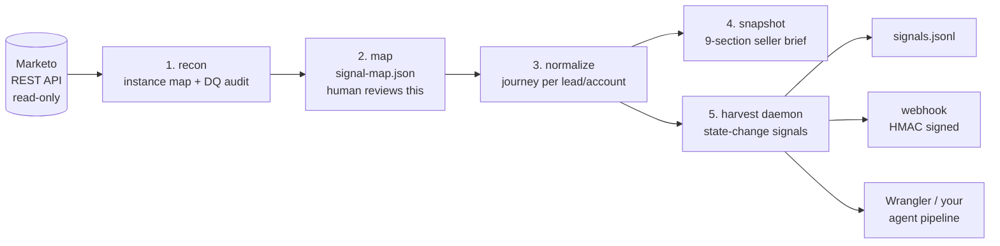

# Marketo Auto Recon

[](https://github.com/austinjgilbert/marketo-auto-recon/actions/workflows/ci.yml)
[](LICENSE)


**Point it at any Marketo instance — even one nobody understands — and in an afternoon you get
a full map of what's in there, chronological buyer journeys, seller-ready briefs, and a live
feed of buying signals.**

Most Marketo instances are years of accumulated fields, programs, and custom activities that
nobody can explain — while sellers fly blind on accounts whose entire buying journey is sitting
right there in the activity log. Marketo Auto Recon closes that gap with five stages:

1. **Recon** — inventory every activity type, field, form, program, and asset; flag the junk.
2. **Map** — classify what it found into a canonical signal taxonomy you can hand-edit.
3. **Normalize** — turn raw activity history into one chronological journey per lead and account.
4. **Snapshot** — produce a 9-section seller brief in under 5 seconds: who this is, what they
   care about, where they're stuck, what to say, and who else is on the buying committee.
5. **Harvest** — continuously watch for state changes (form fill, pricing visit, content binge,
   stall, reactivation, committee growth) and emit deduped signals to wherever you act on them.



Built to be picked up and run by anyone:

- **Zero npm dependencies.** Node ≥ 18, native `fetch`. `git clone` and run.
- **Read-only, enforced.** The Marketo client is GET-only, and a test fails the suite if any
  other method is ever issued. The single exception is the OAuth handshake — one POST of the
  client credentials to Marketo's identity endpoint (auth, not a write). There is no code path
  that can create, update, or delete anything in Marketo.
- **Works with no LLM key.** Everything is deterministic; `ANTHROPIC_API_KEY` optionally adds
  Claude-written narrative briefs and mapping suggestions.
- **Try it with no Marketo at all.** Every command accepts `--mock` and runs against a bundled
  synthetic instance.

## See it work in 60 seconds (no credentials)

```bash
git clone https://github.com/austinjgilbert/marketo-auto-recon.git
cd marketo-auto-recon
npm run demo    # recon -> map -> snapshot -> harvest -> explain, all against the mock instance
```

Then read `outputs/marketo-instance-map.md` and `outputs/snapshots/` — that's what your real
instance will produce.

**Zero-effort version:** the [examples/](examples/) folder has the committed output of that
demo. Start with [the seller snapshot](examples/snapshots/jane.doe%40acme.com.md) — Jane
submitted "Contact Sales" after months of pricing visits and competitor research, and this is
what her rep sees 20 seconds later.

## Run it on a real instance

```bash
cp .env.example .env      # MARKETO_BASE_URL, MARKETO_CLIENT_ID, MARKETO_CLIENT_SECRET

node bin/mse.js auth      # 1. validate credentials
node bin/mse.js recon     # 2. inventory everything -> outputs/marketo-instance-map.{md,json}
node bin/mse.js map       # 3. classify -> outputs/signal-map.json  (review + hand-edit this)
node bin/mse.js test --email someone@customer.com     # 4. prove the map on one lead
node bin/mse.js snapshot --email someone@customer.com # 5. seller brief -> outputs/snapshots/
node bin/mse.js harvest --daemon --interval 15m       # 6. live signals -> sinks
node bin/mse.js explain   # 7. coverage, confidence, DQ problems, next actions
```

Credentials come from a **read-only** Marketo API user — setup steps, scopes, and a phased
rollout checklist are in [RUNBOOK.md](RUNBOOK.md).

## Go deeper

| Doc | What it gives you |
|---|---|
| [PRODUCT.md](PRODUCT.md) | The product idea — the problem, the thesis, who it's for, design principles |
| [PLAN.md](PLAN.md) | The adoption plan — first afternoon to production daemon, plus how to build on top of it |
| [examples/](examples/) | Committed output of the demo: instance map, signal map, seller snapshot, harvested signals |
| [FAQ.md](FAQ.md) | Safety, permissions, API quota, PII, LLM optionality, multi-instance, porting to other platforms |
| [REFERENCE.md](REFERENCE.md) | Technical reference — stage outputs, journey-blob schema, signal catalog, sinks, code map |
| [RUNBOOK.md](RUNBOOK.md) | Deployment guide for the engineer with Marketo access |
| [CLAUDE.md](CLAUDE.md) | Drop-in instructions so a coding agent (Claude Code / Cursor) drives the whole autopilot for you |
| [CONTRIBUTING.md](CONTRIBUTING.md) | Ground rules and extension points if you want to build on it |

## Tests

```bash
npm test    # node:test — client, recon, mapping, normalizer, interpreter, snapshot, harvester, sinks
```

> Naming note: "Marketo Auto Recon" is the product; the CLI is `mse` (Marketo Signal Engine) —
> same thing. This repo is the standalone home.

## License

MIT — see [LICENSE](LICENSE). Take it, deploy it, build on it.
